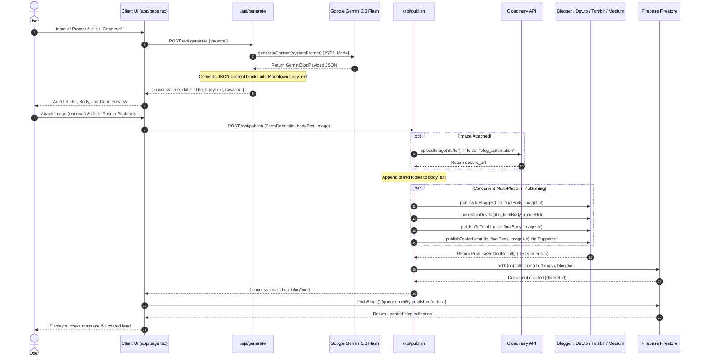

# Architecture & System Documentation: Next-Blog

## 1. Executive Summary & System Overview

**Next-Blog** is an AI-powered, multi-platform automated blog publishing platform built with Next.js 16 (App Router), React 19, TypeScript, and Tailwind CSS v4.

The system empowers users to:
1. **Draft Content via AI**: Input high-level topics to generate SEO-optimized, brand-aligned blog posts in structured JSON & Markdown using Google's Gemini 3.6 Flash model.
2. **Host Media Assets**: Upload cover images directly to Cloudinary via server-side stream uploads.
3. **Cross-Post Concurrently**: Simultaneously publish generated or custom blog content across four external blogging platforms (**Blogger**, **Dev.to**, **Tumblr**, and **Medium**).
4. **Persist & Monitor**: Save canonical post records and cross-platform URLs in Firebase Firestore and display a real-time feed of all published content.

---

## 2. Technical Stack & Dependencies

| Category | Technology | Purpose / Role |
| :--- | :--- | :--- |
| **Framework** | Next.js 16.3.0 (App Router) | Full-stack React framework; API route handlers & server actions |
| **UI Library** | React 19.2.8 / Tailwind CSS v4 | Client-side reactive rendering and responsive styling |
| **Language** | TypeScript 5 | End-to-end type safety |
| **AI Provider** | `@google/generative-ai` (^0.24.1) | Gemini 3.6 Flash API integration for structured JSON draft generation |
| **Database** | Firebase Firestore (`firebase` ^12.17.1) | Persistent document store for published blog records |
| **Media Storage** | Cloudinary (`cloudinary` ^2.10.0) | Stream-based image upload and CDN hosting |
| **Browser Automation** | Puppeteer Extra + Stealth Plugin + Clipboardy | Automated headless/headful Medium publishing via cookie session injection & OS clipboard simulation |
| **Blogger Integration** | Google APIs Node.js Client (`googleapis` ^174.0.1) | OAuth2 authenticated posting via Blogger API v3 |
| **Tumblr Integration** | `tumblr.js` (^5.0.1) | OAuth 1.0a client for Tumblr Legacy Post API |
| **Dev.to Integration** | Native Fetch API | REST API posting with API key authentication |

---

## 3. Directory Structure & File Map

```
next-blog/
├── app/
│   ├── api/
│   │   ├── generate/
│   │   │   └── route.ts          # POST: Generates AI draft via Gemini API
│   │   └── publish/
│   │       └── route.ts          # POST: Processes image upload & publishes to 4 platforms + Firestore
│   ├── favicon.ico
│   ├── globals.css               # Global CSS & Tailwind imports
│   ├── layout.tsx                # Root layout wrapper with Geist fonts
│   └── page.tsx                  # Primary client-side dashboard UI (Form + Live Feed)
├── lib/
│   ├── cloudinary.ts             # Cloudinary SDK config & buffer stream uploader
│   ├── firebase.ts               # Firebase App & Firestore initialization
│   └── services.ts               # Platform publishing implementations (Blogger, Dev.to, Tumblr, Medium)
├── public/                       # Static public assets
├── .env                          # Environment variables & platform credentials
├── next.config.ts                # Next.js configuration (External packages, headers, image domains)
├── package.json                  # Dependencies and scripts
└── tsconfig.json                 # TypeScript compiler configuration
```

---

## 4. Environment Variables Reference (`.env`)

| Variable Name | Required By | Description / Format |
| :--- | :--- | :--- |
| `GEMINI_API_KEY` | `app/api/generate/route.ts` | Google Gemini API key for `gemini-3.6-flash` |
| `CLOUDINARY_CLOUD_NAME` | `lib/cloudinary.ts` | Cloudinary cloud account name |
| `CLOUDINARY_API_KEY` | `lib/cloudinary.ts` | Cloudinary API key |
| `CLOUDINARY_API_SECRET` | `lib/cloudinary.ts` | Cloudinary API secret |
| `BLOGGER_CLIENT_ID` | `lib/services.ts` | Google OAuth2 Client ID for Blogger API |
| `BLOGGER_CLIENT_SECRET` | `lib/services.ts` | Google OAuth2 Client Secret for Blogger API |
| `BLOGGER_REFRESH_TOKEN` | `lib/services.ts` | Google OAuth2 Refresh Token with Blogger write scope |
| `BLOGGER_BLOG_ID` | `lib/services.ts` | Target Blogger blog numeric ID |
| `DEV_TO_API_KEY` | `lib/services.ts` | Dev.to user API Key |
| `TUMBLR_CONSUMER_KEY` | `lib/services.ts` | Tumblr OAuth 1.0a Consumer Key |
| `TUMBLR_CONSUMER_SECRET` | `lib/services.ts` | Tumblr OAuth 1.0a Consumer Secret |
| `TUMBLR_TOKEN` | `lib/services.ts` | Tumblr OAuth 1.0a Access Token |
| `TUMBLR_TOKEN_SECRET` | `lib/services.ts` | Tumblr OAuth 1.0a Access Token Secret |
| `TUMBLR_BLOG_IDENTIFIER` | `lib/services.ts` | Tumblr Blog Identifier (e.g. `venurabanquet`) |
| `MEDIUM_COOKIES` | `lib/services.ts` | JSON array string of valid Medium session cookies (`uid`, `sid`) |
| `COOKIE_FILE_PATH` | `lib/services.ts` | Optional fallback filepath to `medium_cookies.json` |
| `NEXT_PUBLIC_FIREBASE_API_KEY` | `lib/firebase.ts` | Firebase Web API Key |
| `NEXT_PUBLIC_FIREBASE_AUTH_DOMAIN` | `lib/firebase.ts` | Firebase Auth Domain |
| `NEXT_PUBLIC_FIREBASE_PROJECT_ID` | `lib/firebase.ts` | Firebase Project ID |
| `NEXT_PUBLIC_FIREBASE_STORAGE_BUCKET` | `lib/firebase.ts` | Firebase Storage Bucket |
| `NEXT_PUBLIC_FIREBASE_MESSAGING_SENDER_ID` | `lib/firebase.ts` | Firebase Messaging Sender ID |
| `NEXT_PUBLIC_FIREBASE_APP_ID` | `lib/firebase.ts` | Firebase App ID |

---

## 5. Data Models & Interface Contracts

### 5.1. Firestore Document Schema (`blogs` Collection)

```typescript
interface BlogDocument {
  id?: string;               // Auto-generated Firestore document ID
  title: string;             // Blog article title
  bodyText: string;          // Full Markdown content (including brand footer)
  imageUrl: string | null;   // Secure Cloudinary URL or null
  bloggerUrl: string;        // Published Blogger URL OR error message string
  devtoUrl: string;          // Published Dev.to URL OR error message string
  tumblrUrl: string;         // Published Tumblr URL OR error message string
  mediumUrl: string;         // Published Medium URL OR error message string
  publishedAt: string;       // ISO 8601 Timestamp string (e.g. "2026-08-13T20:47:00.000Z")
}
```

### 5.2. AI Generated Schema (Gemini `application/json` Response)

```typescript
interface ContentBlock {
  type: 'quote' | 'h2' | 'h3' | 'p' | 'list';
  text?: string;
  items?: string[];
}

interface GeminiBlogPayload {
  slug: string;
  title: string;
  category: string;
  tags: string[];
  badge: string;
  badgeBg: string;
  description: string;
  date: string;
  readTime: string;
  featuredImage: string;
  cardImage: string;
  sidebarImage: string;
  author: {
    name: string;
    role: string;
    avatar: string;
  };
  content: ContentBlock[];
}
```

### 5.3. Service Result Contract (`PublishResult`)

```typescript
export interface PublishResult {
  action: 'published';
  status: 'success' | 'failed';
  url?: string;
  error?: string;
}
```

---

## 6. End-to-End System Workflows



---

## 7. Deep Dive into Modules & APIs

### 7.1. Client UI (`app/page.tsx`)
- **State Management**: Controls form inputs (`title`, `bodyText`, `image`, `aiPrompt`), generation loading state (`isGenerating`), publishing loading state (`loading`), output feedback (`message`, `rawJsonOutput`), and blog feed history (`blogs`).
- **Data Fetching**:
  - `fetchBlogs()`: Executes a Firestore query `query(collection(db, 'blogs'), orderBy('publishedAt', 'desc'))` on component mount and post-publish.
  - `handleGenerateAI()`: Calls `POST /api/generate`. Populates `title`, `bodyText` (markdown formatted), and `rawJsonOutput` (verbatim codebase JSON object).
  - `handleSubmit()`: Constructs a `FormData` object and posts to `POST /api/publish`.

### 7.2. AI Generation API (`app/api/generate/route.ts`)
- **Model**: `gemini-3.6-flash` initialized with `responseMimeType: "application/json"`.
- **Persona Context**: Hardcoded as **Pratham Shankwalker**, Founder & CEO of **Venura** (Banquet hall management software in India).
- **System Prompt Rules**:
  - Mandates specific pricing details (₹999/month, 30-day free trial, 48-hour setup time).
  - Strict content structure: Quote -> Problem Statement (h2) -> Solution Breakdown (h2+h3+p) -> Comparison/Checklist (list) -> Why Venura (h2) -> FAQ (h3) -> Call to Action (CTA).
  - Category to badge/color mapping.
  - Image naming convention (`/images/[primary-keyword]-[descriptor].png`).
- **Markdown Conversion**: Iterates through `data.content` array and transforms block elements (`quote`, `h2`, `h3`, `p`, `list`) into standard Markdown syntax.

### 7.3. Publishing Orchestrator (`app/api/publish/route.ts`)
- **Multi-part Form Processing**: Extracts `title`, `bodyText`, and `image` file buffer.
- **Cloudinary Integration**: Converts image `ArrayBuffer` to Node `Buffer` and calls `uploadImage(buffer)`.
- **Brand Footer Injection**: Appends standard footer string:
  ```
  **Venura**
  India's #1 banquet hall management software...
  Website: https://www.usevenura.com/
  © 2026 Venura Technologies Inc. All rights reserved.
  ```
- **Resilient Concurrency**: Wraps all 4 platform publisher promises inside `Promise.allSettled(...)`. Ensures that if one platform fails (e.g. Medium cookie expired), the remaining platforms still publish and their URLs/errors are recorded accurately.
- **Persistence**: Writes the composite result object to Firestore `blogs` collection.

### 7.4. Publishing Services (`lib/services.ts`)

#### 1. Dev.to (`publishToDevTo`)
- **Protocol**: Direct REST API call via native `fetch`.
- **Endpoint**: `POST https://dev.to/api/articles`
- **Headers**: `api-key: process.env.DEV_TO_API_KEY`, `Content-Type: application/json`
- **Payload**: `{ article: { title, body_markdown, main_image, published: true } }`

#### 2. Blogger (`publishToBlogger`)
- **SDK**: `googleapis.google.blogger({ version: 'v3', auth: oauth2Client })`
- **Auth**: Google OAuth2 client using `BLOGGER_CLIENT_ID`, `BLOGGER_CLIENT_SECRET`, and `BLOGGER_REFRESH_TOKEN`.
- **HTML Transformation**: Converts line breaks `\n` to `<br>` and prepends `` tag if `imageUrl` is present.
- **API Call**: `blogger.posts.insert({ blogId, isDraft: false, requestBody: { title, content } })`.

#### 3. Tumblr (`publishToTumblr`)
- **SDK**: `tumblr.js` using `createClient` (OAuth 1.0a).
- **HTML Transformation**: Converts text line breaks to `<br>` and prepends image `` tag.
- **Legacy Post API**: Calls `client.createLegacyPost(TUMBLR_BLOG_IDENTIFIER, { type: 'text', title, body, state: 'published' })`.
- **URL Construction**: Returns `https://www.tumblr.com/${TUMBLR_BLOG_IDENTIFIER}/post/${response.id}`.

#### 4. Medium (`publishToMedium`) — Automated Browser Engine
- **Why Puppeteer?**: Medium API access is deprecated/restricted. This service uses Puppeteer with `puppeteer-extra-plugin-stealth` for browser automation.
- **Cookie Injection**: Reads `MEDIUM_COOKIES` env or `COOKIE_FILE_PATH` file (`medium_cookies.json`), normalizes domain/path attributes, and injects them via `page.setCookie()`.
- **Editor Bypass via Clipboard**:
  - Standard Puppeteer `page.type()` or `element.value` fails on Medium's custom Draft.js/ProseMirror contenteditable editor.
  - **Solution**: The `pasteText(page, text)` helper uses `clipboardy.write(text)` to write content directly into the host OS system clipboard, brings the page to front, and sends native OS keyboard input `Ctrl+V`.
- **Image Auto-Unfurl**: Pastes Cloudinary `imageUrl` as a text line into the editor and waits 4000ms for Medium's native link unfurler to embed the remote image.
- **Two-Stage Publishing Flow**:
  1. Locates top navigation "Publish" button and clicks it to open the pre-publish settings drawer.
  2. Polls DOM via `waitForFunction` for the final confirmation button ("Publish now" / "Publish story"), marks it with attribute `data-puppeteer-target="final-publish-btn"`, and triggers `page.click()` alongside `page.waitForNavigation()`.

---

## 8. Critical Architectural Patterns & Special Configurations

### 8.1. Server External Packages Bundle Bypass (`next.config.ts`)
Next.js App Router uses Webpack/Turbopack to bundle server code. Native Node C++ modules (such as Puppeteer binaries and native OS clipboard binaries in `clipboardy`) crash when bundled into Next.js server chunks.
To fix this, `next.config.ts` explicitly marks them as external:

```typescript
// next.config.ts
const nextConfig: NextConfig = {
  serverExternalPackages: [
    'puppeteer-extra',
    'puppeteer-extra-plugin-stealth',
    'puppeteer',
    'clipboardy'
  ],
  // ...
};
```

### 8.2. Cloudinary Remote Image Domain Allowed
To allow `next/image` or standard preview components to render Cloudinary hosted images safely, `next.config.ts` includes:
```typescript
images: {
  remotePatterns: [
    { protocol: 'https', hostname: 'res.cloudinary.com', pathname: '/**' }
  ]
}
```

### 8.3. Firebase Singleton Initialization (`lib/firebase.ts`)
Prevents re-initialization of Firebase app during Next.js Hot Module Replacement (HMR) or multi-route server invocations:
```typescript
const app = !getApps().length ? initializeApp(firebaseConfig) : getApp();
export const db = getFirestore(app);
```

---

## 9. Error Handling & Resilience Matrix

| Component / Subsystem | Failure Scenario | System Behavior & Fallback |
| :--- | :--- | :--- |
| **Gemini API** | Invalid API Key or quota limit | Returns HTTP 500 JSON `{ success: false, error: message }`. Client displays red error alert. |
| **Cloudinary** | Network failure / bad credentials | Throws `Cloudinary Upload Failed`. Halts publishing process before cross-posting begins. |
| **Single Platform Post** | Cookie expiry (Medium), invalid token (Tumblr/Blogger) | `Promise.allSettled` catches individual failure. `status: 'failed'` captured. Remaining platforms still publish. Document saved with error text in corresponding URL field. |
| **Medium Puppeteer** | Button selector change on Medium UI | Throws descriptive error containing list of all clickable DOM elements currently visible for easy debugging. |
| **Firebase Firestore** | Network disconnection / permission denied | Throws error in `handleSubmit`. API returns HTTP 500. UI alerts user. |

---

## 10. Guide for AI Assistants & Automated Developers

When modifying or extending this codebase, any AI agent **MUST** follow these rules:

1. **Adding a New Publishing Platform**:
   - Create a new publishing function in `lib/services.ts` (e.g., `publishToLinkedIn`).
   - Standardize its return signature to `Promise<PublishResult>`.
   - Update `app/api/publish/route.ts` by adding the function to the `Promise.allSettled` array.
   - Update `BlogDocument` interface in `app/page.tsx` and `app/api/publish/route.ts` to persist the new platform URL.
   - Add a badge link in `app/page.tsx` feed UI.

2. **Modifying AI Generation Persona**:
   - Locate `systemPrompt` in `app/api/generate/route.ts`.
   - Ensure the JSON schema contract in `systemPrompt` matches `GeminiBlogPayload`.
   - Update the Markdown parsing loop (`data.content.forEach(...)`) if new block types are introduced.

3. **Running Puppeteer in Server/Docker Environments**:
   - If deploying to a headless Docker container or Vercel, Puppeteer headful mode (`headless: false` in `lib/services.ts`) must be toggled to `headless: true` or replaced with `@sparticuz/chromium`.
   - Ensure OS clipboard capabilities (`clipboardy`) are available or mock clipboard events if running in serverless environments.

4. **Next.js Bundling Rules**:
   - Always retain `serverExternalPackages` entries in `next.config.ts` for any binary or native Node module dependency added in the future.
